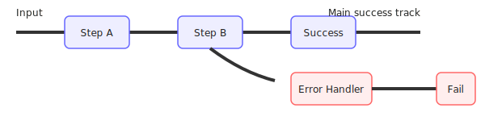

## Railway Oriented Programming (ROP) for Go

Lightweight, composable primitives for building robust synchronous and concurrent processing pipelines in Go using the Railway Oriented Programming pattern.

## Overview

Railway Oriented Programming is a functional programming pattern for handling errors in a clean and composable way. This Go library implements ROP principles using generics, allowing you to build robust error handling pipelines.

### Install

```bash
go get github.com/ib-77/rop3
```

Import paths follow the module name from `go.mod`:

```go
import (
    "github.com/ib-77/rop3/pkg/rop"
    "github.com/ib-77/rop3/pkg/rop/solo"
    "github.com/ib-77/rop3/pkg/rop/mass"
    "github.com/ib-77/rop3/pkg/rop/lite"
    "github.com/ib-77/rop3/pkg/rop/core"
)
```

---

## Core concepts

Railway Oriented Programming visualizes program flow as a railway track:

- Success Track: When operations succeed, they continue along the main track.
- Failure Track: When operations fail, they switch to a parallel error track.

Diagram (simplified):



This repository centers around a typed `Result[T]` that carries either a value, an error (fail), or a cancel signal. The package split is roughly:

- `solo`: single-value, synchronous composition helpers
- `mass`: channel-based building blocks that lift `solo` operations over channels
- `lite`: ergonomic wrappers around `mass` to simplify common patterns and set up multi-worker stages
- `core`: utilities for channel IO and worker orchestration

Common primitives and what they do

- Result[T]: a typed container that can be success, failure, or cancel.
  - `rop.Success(value)` / `rop.Fail[T](err)` / `rop.Cancel[T](err)`
  - Inspect with `IsSuccess()`, `IsCancel()`, `Err()`, `Result()`

Operations (short snippets)

Below are compact, single-line snippets showing common `lite` usage. Full runnable examples are in `examples/lite_examples`.

- Validate:

```go
lite.Validate(func(ctx context.Context, s string) (bool, string) { return s!="", "empty" })
```

- Switch:

```go
lite.Switch(func(ctx context.Context, s string) rop.Result[int] { return rop.Success(1) })
```

- Map:

```go
lite.Map(func(ctx context.Context, n int) int { return n*2 })
```

- DoubleMap:

```go
lite.DoubleMap(func(ctx context.Context, s string) string { return s }, func(ctx context.Context, err error) string { return "err" }, func(ctx context.Context, err error) string { return "cancel" })
```

- Tee / DoubleTee:

```go
lite.Tee(func(ctx context.Context, r rop.Result[int]) { /* side effect */ })
lite.DoubleTee(func(ctx context.Context, v int) {}, func(ctx context.Context, err error) {}, func(ctx context.Context, err error) {})
```

- Try:

```go
lite.Try(func(ctx context.Context, s string) (int, error) { return strconv.Atoi(s) })
```

- Finally:

```go
lite.Finally(ctx, inCh, mass.FinallyHandlers[In, Out]{ OnSuccess: ... })
```

Workers and execution patterns

The `lite` package provides small helpers to run stages with worker pools. Here are the common worker patterns:

- Run: execute a stage over an input channel of `Result[T]` without changing the result type. Use multiple workers to parallelize processing.

```go
out := core.FromChanMany(context.Background(),
    lite.Run(context.Background(), core.ToChanManyResults(context.Background(), []int{1,2,3}),
        lite.Tee(func(_ context.Context, n int) { fmt.Println("processing", n) }), 3), // 3 workers
)
```

- Turnout: execute a stage that changes the underlying value type (e.g., from string to int). This is used when a stage needs to change the pipeline's payload type.

```go
out := core.FromChanMany(context.Background(),
    lite.Turnout(context.Background(),
        lite.Run(context.Background(), core.ToChanManyResults(context.Background(), []string{"1","2"}),
            lite.Switch(toNumber), 2), // Turnout wraps a Run that changes type
    , 2),
)
```

## Custom & cancellation

The `custom` package provides helper wrappers around `lite`/`mass` that let you supply cancellation-aware handlers and utilities to "cancel" or drain remaining results when a context is cancelled.

Key points:
- `custom.Run` / `custom.Turnout` accept `core.CancellationHandlers` so you can control what happens on cancellation (unprocessed, processed, or whole-stream cancellation).
- The `custom/cancels.go` helpers like `CancelRemainingResults`, `CancelRemainingValue`, `CancelResults` and `CancelRemainingValues` make it easy to drain or convert remaining inputs when cancellation happens.
- Toggle processing remaining items with `core.WithProcessOptions(ctx, true)` — when enabled, the cancel helpers will emit corresponding canceled outputs for remaining items.

Compact example (wire up cancel handlers):

```go
ctx = core.WithProcessOptions(ctx, true) // enable draining remaining items on cancel
handlers := core.CancellationHandlers[string, string]{
    OnCancel: func(ctx context.Context, inCh <-chan rop.Result[string], outCh chan<- rop.Result[string]) {
        custom.CancelResults(ctx, inCh, outCh)
    },
    OnCancelUnprocessed: func(ctx context.Context, in rop.Result[string], outCh chan<- rop.Result[string]) {
        custom.CancelRemainingResult(ctx, in, outCh)
    },
}

out := custom.Run(ctx, core.ToChanManyResults(ctx, inputs), custom.Validate(validateFn, nil), handlers, nil, 2)
```

This pattern gives you fine-grained control over pipeline behavior when cancellation occurs (emit cancel markers, map to final values, or simply drain remaining inputs).


- Single-worker execution: run the pipeline with one worker using `lite.Run(..., 1)`. This is useful for deterministic, ordered processing or when parallelism is not desired.

```go
out := core.FromChanMany(context.Background(),
    lite.Run(context.Background(), core.ToChanManyResults(context.Background(), []int{1,2,3}),
        lite.Map(func(_ context.Context, n int) int { return n * 10 }), 1), // one worker
)
```


## Example: URL processing pipeline

The example below mirrors `tests/pipeline_test.go` and demonstrates building a concurrent pipeline that:
- Validates input URLs
- Tries to fetch a page title (mocked in tests)
- Switches to a title-length calculation
- Finally maps each result to a printable string, returning "invalid" on errors/cancels

```go
package main

import (
    "context"
    "fmt"
    "strings"

    "github.com/ib-77/rop3/pkg/rop"
    "github.com/ib-77/rop3/pkg/rop/core"
    "github.com/ib-77/rop3/pkg/rop/lite"
    "github.com/ib-77/rop3/pkg/rop/mass"
)

func processRequest(urls []string) []string {
    ctx := context.Background()

    finallyHandlers := mass.FinallyHandlers[int, string]{
        OnSuccess: func(ctx context.Context, r int) string {
            return fmt.Sprintf("title length: %d", r)
        },
        OnError: func(ctx context.Context, err error) string {
            return "invalid"
        },
        OnCancel: func(ctx context.Context, err error) string {
            return "invalid"
        },
    }

    return core.FromChanMany(ctx,
        lite.Finally(ctx,
            lite.Turnout(ctx,
                lite.Turnout(ctx,
                    lite.Run(ctx,
                        core.ToChanManyResults(ctx, urls),
                        lite.Validate(validateURLTest), 2),
                    lite.Try(mockFetchTitle), 2),
                lite.Switch(calculateTitleLength), 2),
            finallyHandlers,
        ),
    )
}

// validateURLTest checks structure and scheme in this test/demo version
func validateURLTest(_ context.Context, url string) (bool, string) {
    if !strings.HasPrefix(url, "http://") && !strings.HasPrefix(url, "https://") {
        return false, "URL must start with http:// or https://"
    }
    return true, ""
}

// mockFetchTitle simulates a network call based on validation (no HTTP made here)
func mockFetchTitle(ctx context.Context, url string) (string, error) {
    valid, _ := validateURLTest(ctx, url)
    if valid {
        return "Mock Page Title for " + url, nil
    }
    return "", fmt.Errorf("invalid URL")
}

func calculateTitleLength(_ context.Context, title string) rop.Result[int] {
    return rop.Success(len(title))
}
```

Notes:
- `lite.Run` lifts an input channel of `Result[T]` into a worker pool that applies a stage function; `2` creates two workers.
- `lite.Turnout` changes the output type between stages while preserving `Result` semantics.
- `lite.Finally` reduces a channel of `Result[In]` to a channel of final values using the provided handlers.
- `core.FromChanMany` drains the output channel into a slice.

---

## Why ROP here?

- **Explicit success/error/cancel flow**: compile-time assurance and predictable control flow.
- **Composable**: chain simple steps into rich pipelines without hidden control paths.
- **Concurrent by construction**: easily choose worker counts per stage.
- **Testable**: each function is a small, regular Go function; orchestration is separated from business logic.

---


## License

MIT


